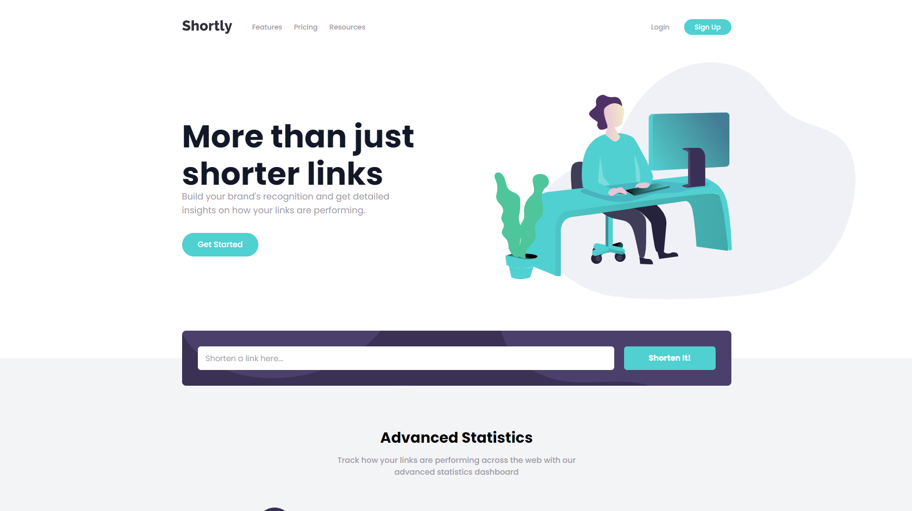

# Frontend Mentor - Shortly URL shortening API Challenge solution

This is a solution to the [Shortly URL shortening API Challenge challenge on Frontend Mentor](https://www.frontendmentor.io/challenges/url-shortening-api-landing-page-2ce3ob-G). Frontend Mentor challenges help you improve your coding skills by building realistic projects. 

## Table of contents

- [Overview](#overview)
  - [The challenge](#the-challenge)
  - [Screenshot](#screenshot)
  - [Links](#links)
- [My process](#my-process)
  - [Built with](#built-with)
  - [What I learned](#what-i-learned)
  - [Continued development](#continued-development)
  - [Useful resources](#useful-resources)
- [Author](#author)
- [Acknowledgments](#acknowledgments)

## Overview

### The challenge

Users should be able to:

- View the optimal layout for the site depending on their device's screen size
- Shorten any valid URL
- See a list of their shortened links, even after refreshing the browser
- Copy the shortened link to their clipboard in a single click
- Receive an error message when the `form` is submitted if:
  - The `input` field is empty

### Screenshot

### Links

- Solution URL: [Github](https://github.com/mqdo/url-shortening)
- Live Site URL: [Netlify](https://mqdo-url-shortening.netlify.app/)

## My process

### Built with

- [React](https://reactjs.org/) - JS library
- [Tailwind CSS](https://tailwindcss.com/) - For styles
- [React Icons](https://react-icons.github.io/react-icons) - For icons
- [Axios](https://axios-http.com/) - For posting API

### What I learned

In this challenge, I learned how to develop a landing page: from understanding the design into practice with coding, svg,... Once again, I used React and Tailwind to create the web app and quite satisfied with the results. One thing I noticed is that when making the UI, flex is everywhere, especially when making responsive. If these are in one line, of the same direction then it must be flex. Also I quite surprise that over one million people using the react-copy-to-clipboard dependency every week! This tool is very helpful yet also simple.

### Continued development

Even though I managed to complete the challenge, it still takes me hours to complete. In the future I must improve the performance to develop faster and more effective.

### Useful resources

- [Chat GPT](https://chat.openai.com/chat) - At this point I must say that this AI tool is a game changer, it is even better than Google and Stack Overflow at most cases.
- [React Copy To Clipboard](https://www.npmjs.com/package/react-copy-to-clipboard) - As mentioned above, this dependency helped me with handling copy-to-clipboard, by just writing some lines of code.

## Author

- Website - [mqdo](https://github.com/mqdo/)
- Frontend Mentor - [@mqdo](https://www.frontendmentor.io/profile/mqdo)

## Acknowledgments

This is where you can give a hat tip to anyone who helped you out on this project. Perhaps you worked in a team or got some inspiration from someone else's solution. This is the perfect place to give them some credit.
